<p align="center">
  
</p>

<h1 align="center">External Cheat</h1>

<p align="center">
  <b>By BigH</b><br>
  External trainer for Counter-Strike 2 (Source 2, x64), written in C++20 as a separate program<br>
  <sub>Personal learning project · offline bot matches under <code>-insecure</code> only</sub>
</p>

---

A personal learning project: an **external** trainer for **Counter-Strike 2**. It's a normal 64-bit console program
that runs **next to** the game, never inside it. It reads the game's memory with `ReadProcessMemory`, finds everything
it needs (offsets, interfaces, the schema system, the entity list) from outside the process, and draws its ESP and
menu in **its own transparent window** on top of the game.

It's the third project in a series:
1. [W Cheat](https://github.com/BigH018/assault-cube-project): an external Python trainer for AssaultCube.
2. [Internal Cheat](https://github.com/BigH018/internal-assault-cube): an internal C++ DLL for AssaultCube, which
   hooks, patches and calls the game's own code.
3. **This project:** back to external, but in C++ and against a modern 64-bit Source 2 game. The game is closed
   source, its offsets change with every update, and its entities are spread over a chunked entity system. So most of
   the work here is *finding things*: offsets, signatures, interfaces, schema fields, bones. Then it *proves* them
   against the running game every time it starts.

> **Scope:** offline, single-player bot matches on my own PC, with CS2 started with `-insecure` (which turns VAC off).
> The tool is never run on a VAC-secured server, never shared or distributed, and contains no stealth or evasion of any
> kind: no injection, no hooks, no driver, no manual mapping, no hidden threads or modules, no obfuscation, no network
> code. It opens a normal process handle that any debugger could see.

## Screenshots

<p align="center">
  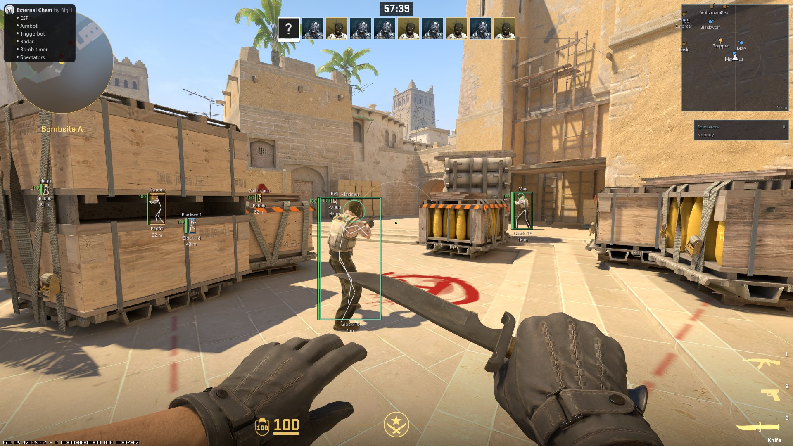
  <br><sub><b>In-game:</b> boxes, skeletons, head circles, names, health bars and numbers, weapons and distances, with
  teammates shown too. Colours come from the game's spotted-by mask: teammates in plain view are green, those behind
  walls blue, enemies behind the crates orange. Also visible: the aimbot's FOV circle, our own radar (top right), the
  spectator list under it, and the watermark listing the active features (top left)</sub>
</p>

<p align="center">
  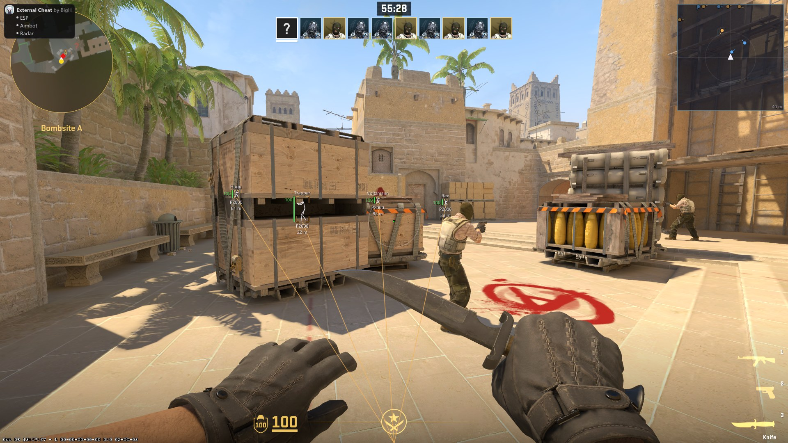
  <br><sub><b>In-game:</b> another profile, with corner boxes, skeletons and snaplines on enemies only. The terrorists
  in plain view are teammates, so nothing is drawn on them</sub>
</p>

<p align="center">
  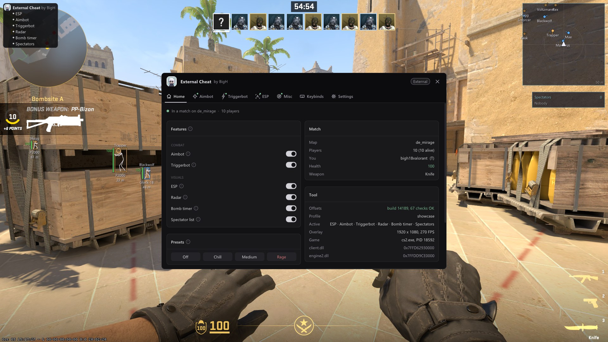
  <br><sub><b>The menu over the running game</b> (INSERT). It is our own window: the game keeps rendering underneath,
  and the ESP stays drawn around it</sub>
</p>

<table>
  <tr>
    <td align="center" width="50%">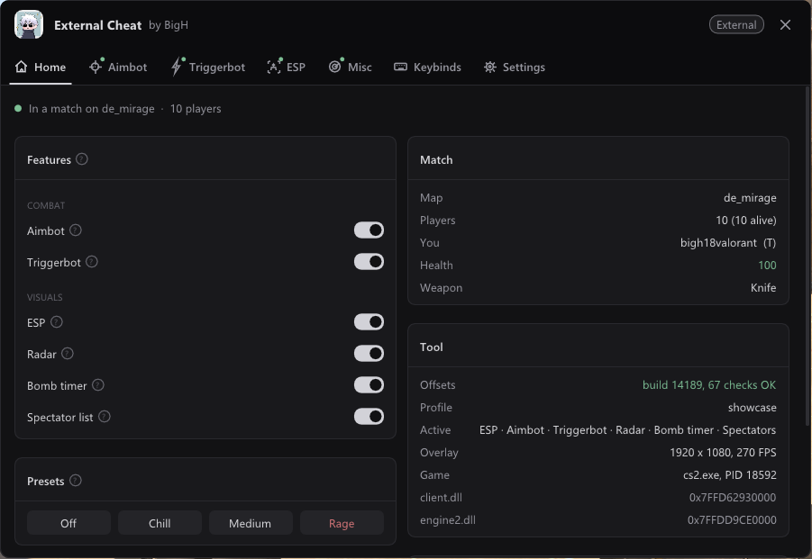<br><sub><b>Home</b>: every feature's switch, presets, the match, the tool's status (the offset check, profile, overlay)</sub></td>
    <td align="center" width="50%">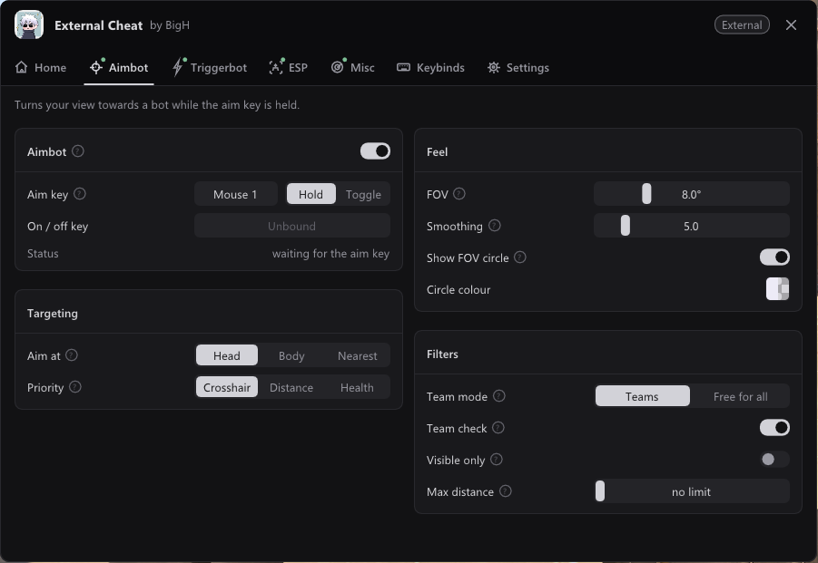<br><sub><b>Aimbot</b>: key and mode, aim point, priority, FOV, smoothing, filters, a live status line</sub></td>
  </tr>
  <tr>
    <td align="center">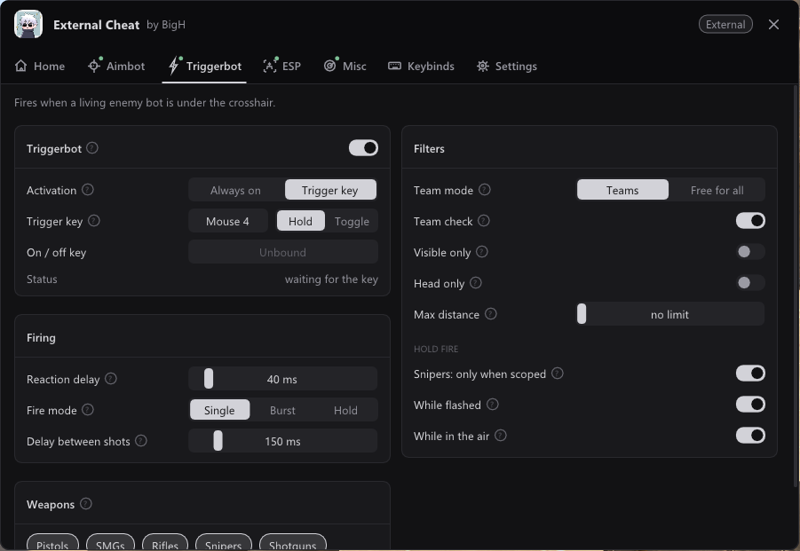<br><sub><b>Triggerbot</b>: activation, reaction delay, single / burst / hold, filters, weapon classes, hold-fire rules</sub></td>
    <td align="center">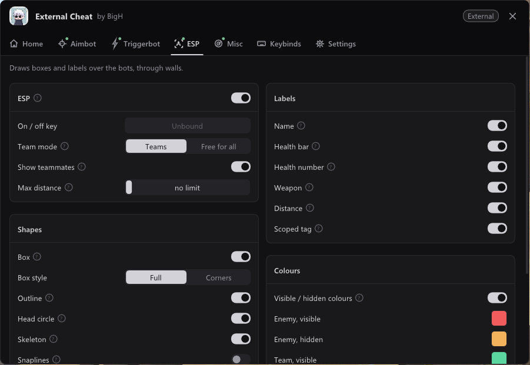<br><sub><b>ESP</b>: team mode, shapes, labels, visible / hidden colours with opacity</sub></td>
  </tr>
  <tr>
    <td align="center">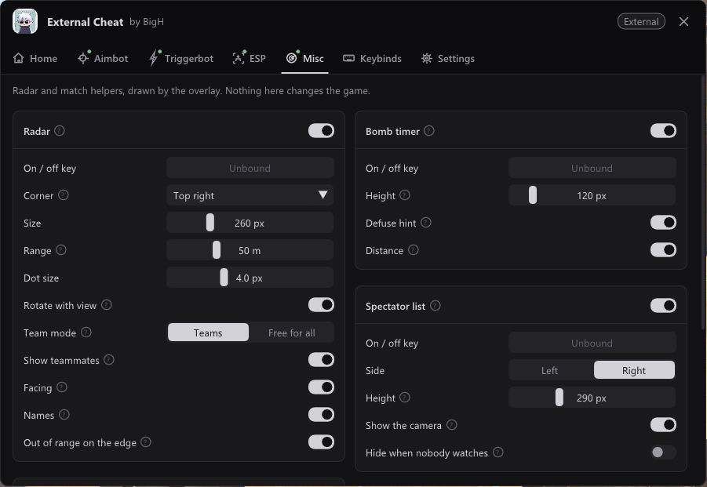<br><sub><b>Misc</b>: radar, bomb timer and spectator list, each with its own options</sub></td>
    <td align="center">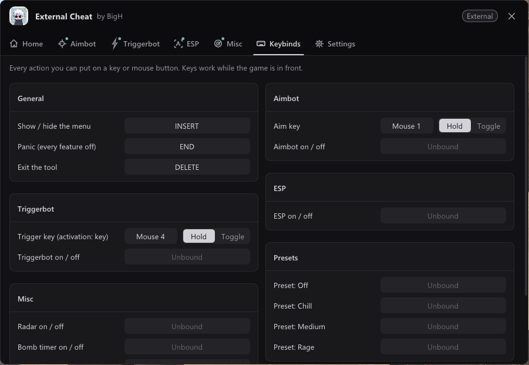<br><sub><b>Keybinds</b>: every action on any key or mouse button, hold / toggle, conflicts in red</sub></td>
  </tr>
  <tr>
    <td align="center">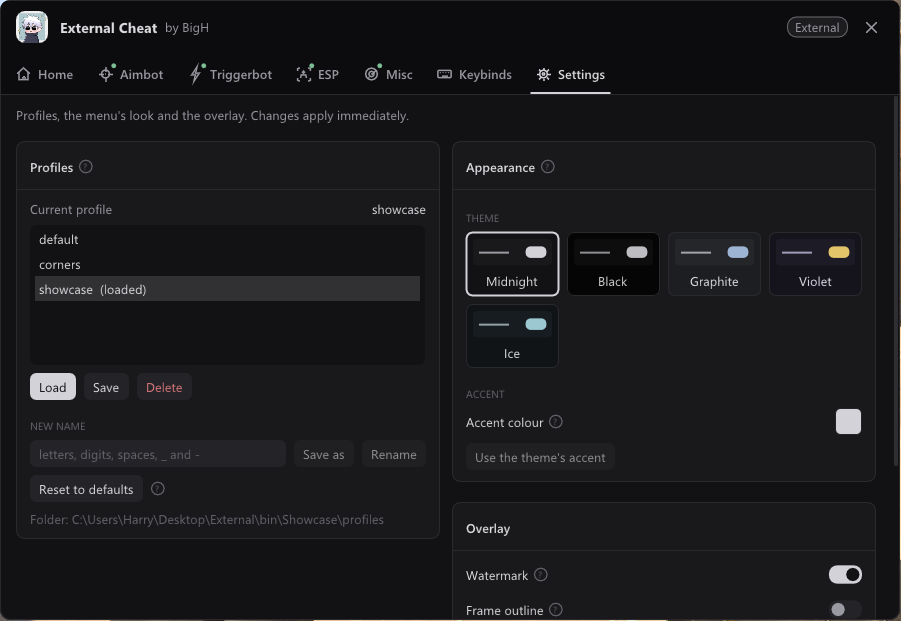<br><sub><b>Settings</b>: profiles, five themes plus an accent colour, the overlay, Exit</sub></td>
    <td align="center"><br><sub>The same page in the <b>Violet</b> theme, applied live (and marked as an unsaved change)</sub></td>
  </tr>
</table>

<table>
  <tr>
    <td align="center" width="40%">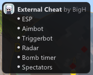<br><sub><b>Watermark</b>: the logo, the name and the features that are on</sub></td>
    <td align="center" width="60%"><br><sub><b>Radar</b> (rotated with your view, 50 m, names on) and the <b>spectator list</b> (nobody watches: it's a Deathmatch)</sub></td>
  </tr>
</table>

<sub>Captured from the running game (CS2 build 14189, de_mirage, an offline Deathmatch against frozen bots, 1920×1080
borderless): a screen grab of the game plus our overlay window, with no post-processing. The bomb timer isn't pictured:
it only appears while a bomb is planted, and a Deathmatch has none.</sub>

## Contents
- [Screenshots](#screenshots)
- [Features](#features)
- [Requirements](#requirements) · [Build](#build) · [Run](#run) · [Using the menu](#using-the-menu) ·
  [Troubleshooting](#troubleshooting) · [Tests](#tests) · [Project layout](#project-layout)
- [How it works (the educational part)](#how-it-works-the-educational-part)
  1. [External vs internal](#1-external-vs-internal-the-same-question-from-the-other-side)
  2. [Opening the game](#2-opening-the-game-a-process-handle-and-module-bases)
  3. [Reading another process's memory](#3-reading-another-processs-memory)
  4. [Where the offsets come from](#4-where-the-offsets-come-from)
  5. [Signature scanning](#5-signature-scanning-finding-globals-in-the-code)
  6. [`CreateInterface` without calling it](#6-createinterface-without-calling-it)
  7. [The schema system from outside](#7-the-schema-system-from-outside)
  8. [The entity system: chunks, identities and handles](#8-the-entity-system-chunks-identities-and-handles)
  9. [Reading a player: snapshots, weapons, bones](#9-reading-a-player-snapshots-weapons-bones)
  10. [World-to-screen and the ESP](#10-world-to-screen-and-the-esp)
  11. [The overlay window](#11-the-overlay-window-drawing-on-top-without-touching-the-game)
  12. [Visibility without a trace](#12-visibility-without-a-trace-the-spotted-by-mask)
  13. [Aimbot: angles and smoothing](#13-aimbot-angles-and-smoothing)
  14. [Triggerbot: pressing the game's buttons](#14-triggerbot-pressing-the-games-buttons)
  15. [Radar, bomb timer, spectator list](#15-radar-bomb-timer-spectator-list-read-only-features)
  16. [Keybinds, profiles and presets](#16-keybinds-profiles-and-presets)
  17. [Safety: never crash, never leave a button pressed](#17-safety-never-crash-never-leave-a-button-pressed)
  18. [How it all fits together](#18-how-it-all-fits-together)
  19. [After a CS2 update](#19-after-a-cs2-update)
  20. [What I learned, phase by phase](#20-what-i-learned-phase-by-phase)
- [Credits and licences](#credits-and-licences)

## Features

- **Menu:** toggled with **INSERT**. A header with the logo, **tabs with drawn icons** (Home, Aimbot, Triggerbot, ESP,
  Misc, Keybinds, Settings; a green dot marks the features that are on), and every page in **two columns of panels**.
  Each option is a row with a label, a **(?)** help tooltip and an aligned control: switches, sliders, segmented
  buttons and colour swatches. **Five dark themes** (Midnight, Black, Graphite, Violet, Ice) plus an accent colour.
  Every change applies live.
- **ESP:** full or corner boxes with an optional outline, head circle, skeleton (from the bone array), name, health bar
  and number, weapon, distance in metres, a **SCOPED** tag on bots zoomed in with a sniper, snaplines (from the bottom,
  centre or top), team mode (Teams / Free for all), teammates on or off, max distance, **visible / hidden colours**,
  colours with opacity, line thickness.
- **Aimbot:** hold or toggle key (default: hold Mouse 1), aim at head / body / the nearest of five bones, priority
  (crosshair / distance / lowest health), FOV with a circle, **frame-rate-independent smoothing**, team check, max
  distance, **visible only**, a live status line.
- **Triggerbot:** fires while a living enemy is under the crosshair. Always on or on a key (hold / toggle), reaction
  delay, **single tap / burst of N / hold**, delay between shots, team check, visible only, head only, max distance,
  **weapon classes** (pistol, SMG, rifle, sniper, shotgun, heavy), snipers only when scoped, never while flashed or in
  the air. A status line says why it isn't firing right now.
- **Radar:** our own, drawn by the overlay: a see-through square in any corner (150–600 px, 10–150 m range), rotated
  with your view or north-up, every player as a dot with a facing line, optional names, out-of-range players faded on
  the edge.
- **Bomb timer:** while a bomb is planted: the site, the seconds left, a bar coloured by whether a defuse started now
  would make it (no kit / only with a kit / too late) with the two latest-defuse marks, who is defusing and whether
  they'll make it, your distance to the bomb.
- **Spectator list:** every dead player watching you in first or third person (or, while you're dead, who else watches
  the player you're watching).
- **Watermark:** the logo, "External Cheat by BigH" and the features that are on, one per line.
- **Keybinds** for every action (any keyboard key or mouse button incl. Mouse 4/5; hold / toggle / press), with conflict
  highlighting. Presses come from raw input, so no tap is ever lost.
- **Profiles** saved as JSON (forgiving load, read-only `default`, the last profile loads on start) and **presets**
  (Off / Chill / Medium / Rage).
- **Panic** (END): every feature off, nothing pressed, menu closed. **Exit** (DELETE, or the Settings page): restore,
  remove the overlay, close the handle.
- **A startup offset diagnostic** that proves every offset, signature, interface and schema field against the running
  game (67 checks in a match), also available on its own as `--diag`, and a console **live view** (`--live`).

**What an external tool can't do** (and this one doesn't try):

| Feature | Why it needs code inside the game |
|---|---|
| Exact "is this bot visible right now" | That's the game's `TraceLine`, a function call. External uses the game's own spotted-by mask instead (section 12) |
| Silent aim | Needs to change the shot inside the game's `CreateMove`; external can only move the real view |
| No recoil / no spread by patching | Patching the weapon code is writing to the game's code. This project never writes code, only two data fields |
| Sub-tick-accurate angle writes | Our writes land whenever our frame runs, not on the game's input tick |

Those would need a DLL, injection and hooks: a separate project, not a quiet slide into internal.

## Requirements
- Windows 10/11, x64.
- **Counter-Strike 2** via Steam, launched with **`-insecure`** (Steam → CS2 → Properties → Launch Options:
  `-insecure -console -novid -nojoy`). Display mode **Windowed** or **Fullscreen Windowed** (the overlay can't sit on
  top of exclusive fullscreen).
- **Visual Studio 2022 or 2026** with the **Desktop development with C++** workload and the **MSVC v143** toolset (VS 2026
  installs it alongside v145; decline any offer to retarget the projects).
- Optional: Python 3 + Pillow, only to regenerate the logo header after changing `assets/logo.jpg`.

Everything else (Dear ImGui, doctest, nlohmann/json) is vendored in [`external/`](external/README.md).

> **Offsets are tied to a CS2 build.** The values in this repo are for **build 14189**. After a CS2 update the startup
> diagnostic will flag what moved; see [After a CS2 update](#19-after-a-cs2-update).

## Build
Open `cs2-external.sln`, pick **Release | x64** and build (Ctrl+Shift+B). Or from the repo root:

```powershell
# msbuild may not be on PATH even in a Developer PowerShell; this finds it:
$msb = & "${env:ProgramFiles(x86)}\Microsoft Visual Studio\Installer\vswhere.exe" -latest -find "MSBuild\**\Bin\amd64\MSBuild.exe"
& $msb cs2-external.sln /m /p:Configuration=Release /p:Platform=x64
```

Output in `bin\Release\`: `cs2_external.exe` (the tool) and `tests.exe` (unit tests). There is **only an x64
configuration**: CS2 is 64-bit, and a 32-bit tool couldn't hold its addresses.

The build uses `/W4 /WX` (every warning is an error) and the static CRT, so no Visual C++ runtime needs to be installed.

## Run
1. Start CS2 with `-insecure` and join an offline **Practice with Bots** match.
2. Run `bin\Release\cs2_external.exe`. It finds `cs2.exe`, runs the offset diagnostic, loads your last profile and puts
   its overlay over the game. If the game runs as administrator, the tool has to as well.
3. In the game: **INSERT** = menu, **END** = panic, **DELETE** = exit.

```powershell
bin\Release\cs2_external.exe          # the overlay (diagnostic first)
bin\Release\cs2_external.exe --diag   # only the offset diagnostic, then exit: exit code 0 = all OK, 2 = a check failed
bin\Release\cs2_external.exe --live   # a console table of every player, ~4 times a second (read-only)
```

`--diag` and `--live` open the game **read-only**. Only the overlay asks for write access, for the aimbot's view angles
and the triggerbot's attack button.

## Using the menu

| Page | What's there |
|---|---|
| **Home** | Match status line; **Features** (a switch for each), **Presets**; **Match** (map, players, you, health, weapon), **Tool** (offset check, profile and unsaved changes, active features, overlay size and FPS, PID, module bases), **Keys** |
| **Aimbot** | Enable, aim key + Hold / Toggle, on/off key, status; **Targeting** (head / body / nearest, priority); **Feel** (FOV, smoothing, FOV circle + colour); **Filters** (team mode, team check, visible only, max distance) |
| **Triggerbot** | Enable, activation (always / trigger key), keys, status; **Firing** (reaction delay, single / burst / hold, burst size, delay between shots); **Filters** (team, visible only, head only, max distance; hold fire for unscoped snipers, flashes, jumps); **Weapons** (class chips) |
| **ESP** | Enable + key, team mode, teammates, max distance; **Shapes** (box, style, outline, head circle, skeleton, snaplines + origin, thickness); **Labels** (name, health bar / number, weapon, distance, SCOPED); **Colours** (visible / hidden for enemies and teammates, skeleton, text) |
| **Misc** | **Radar** (corner, size, range, dot size, rotate, teammates, facing, names, edge) + its colours; **Bomb timer** (height, defuse hint, distance); **Spectator list** (side, height, camera mode, hide when nobody watches) |
| **Keybinds** | Every action by category (General, Aimbot, Triggerbot, ESP, Misc, Presets). Click a key button, then press any key or mouse button; **Esc** clears it. Conflicts show in red and are listed |
| **Settings** | **Profiles** (list, Load, Save, Delete, Save as, Rename, Reset to defaults, warnings, folder); **Appearance** (theme tiles, accent colour); **Overlay** (watermark, frame outline); **Exit** |

### Default hotkeys
| Key | Action |
|---|---|
| INSERT | Show / hide the menu (any keyboard key that isn't a modifier; it can't be unbound) |
| END | **Panic**: every feature off, toggle keys off, the attack button released, menu closed |
| DELETE | **Exit**: release everything, remove the overlay, close the handle, quit |
| Mouse 1 (hold) | Aimbot (when enabled) |
| Mouse 4 (hold) | Triggerbot (when enabled in Trigger key mode) |

Every feature's on/off key and the four presets can be bound on the Keybinds page (unbound by default). Keys work only
while CS2 or the menu is in front; while the menu is open only INSERT, END and DELETE do anything.

### Presets
One click on Home (or a key) switches the features and their strength. Keybinds, colours, team mode, team checks, max
distances, positions and the overlay are never touched. The result counts as an unsaved change until you save it.

| Preset | What it turns on |
|---|---|
| **Off** | Nothing: every feature off |
| **Chill** | Corner-box ESP; body aimbot (FOV 3°, smoothing 12, visible only); no triggerbot; radar, bomb timer, spectators |
| **Medium** | Full ESP with skeleton and head circle; head aimbot (FOV 6°, smoothing 6, visible only); triggerbot on its key (80 ms, single); radar, bomb timer, spectators |
| **Rage** | Everything, with snaplines; head aimbot (FOV 30°, smoothing 1 = snap, not visible-only); triggerbot always on (0 ms, hold, no flash / air / scope limits); radar, bomb timer, spectators |

### Profiles
- Profiles are JSON files in `profiles\` **next to the exe** (`bin\Release\profiles\`). The last one you loaded or saved
  loads on the next start.
- Changes apply immediately but are saved only when you click **Save**. Home and Settings say "unsaved changes".
- `default` is built in and read-only (use **Save as**). Saving is atomic (a `.tmp` file, then a replace).
- A hand-edited profile with bad values still loads: unknown keys are ignored, wrong types / bad colours / bad names
  fall back to the default, numbers are clamped, and each change is listed as a warning (in the console and on the
  Settings page).

### The console
The console shows the startup diagnostic and the overlay's log. Shortened:

```
[+] External Cheat by BigH (CS2, offline only: -insecure, bots, never a VAC server)
[+] cs2.exe      PID 18592
[+] client.dll   base 0x7FFD62930000  size 0x299B000
[+] --- Offset diagnostic (dumps: CS2 build 14189, a2x/cs2-dumper) ---
[+]   OK   game build 14189 (engine2.dll + dwBuildNumber), dumps from build 14189
[+]   OK   SchemaSystem_001           schemasystem.dll -> 0x7FFDD9B76710  (schemasystem.dll+0x76710, dump +0x76710; the module registers 1)
[+] client.dll copied for scanning: 41 MiB in 7 ms (0 unreadable pages)
[+]   OK   dwEntityList               0x2717828    1 hit  (dump 0x2717828)
[+]   OK   dwLocalPlayerPawn          0x2562808    1 hit, +0xF8  (dump 0x2562808)
[+]   OK   C_CSPlayerPawn::m_entitySpottedState         0x1E88   live 0x1E88
[+]   OK   Bones (model state + 0x80) 10 of 10 alive players; head bone 52 to 60 units above the feet
[+] --- Offset diagnostic: all 67 checks OK ---
[+] Profile "showcase" loaded (0 warnings) from C:\...\profiles
[+] Overlay D3D11 device ready (feature level 11.0)
[+] Overlay covers 1920x1080 at (0, 0)
[+] In a match (local pawn 0x4DF5FEA7000)
```

And `--live`:

```
External Cheat - live view (Ctrl+C to exit)
map de_mirage   tick 27463   curtime 429.10   interval 0.0156   max clients 64
view matrix OK   w row [0.594 0.801 -0.082 2248.8]
10 players, 10 alive   (read in 0.36 ms)

  #  TEAM NAME                 STATE     HP  ARM  WEAPON                X        Y       Z      DIST  NOTES
  1  T    bigh18valorant       alive    100  100  Knife              -620    -2360    -171         -  YOU
  2  CT   Trapper              alive    100  100  P2000              -654    -1487    -168    22.2 m
  3  T    Mae                  alive    100  100  Glock-18            -78    -2042    -168    16.0 m
  ...
```

## Troubleshooting
| Problem | Fix |
|---|---|
| "cs2.exe not found" | Start CS2 first. |
| `OpenProcess` access denied | The game runs as administrator: run the tool as administrator too. |
| A `FAIL` line in the diagnostic | CS2 was updated and an offset moved. See [After a CS2 update](#19-after-a-cs2-update). Features may draw garbage until it's fixed. |
| No overlay | Use Windowed or Fullscreen Windowed. The overlay also hides on purpose whenever neither CS2 nor the menu is in front, or the game is minimised. |
| INSERT does nothing | Another program holds that key as a hotkey (the console says so once). Bind the menu to another key on the Keybinds page. |
| The game still shoots / turns while the menu is open | The menu didn't get focus. Click the menu once. (It normally takes focus by itself: see section 11.) |
| The game's FPS drops while the menu is open | Normal: CS2 sleeps while it isn't the focused window (`engine_no_focus_sleep`). |
| The visible colour switches late | The spotted-by mask is refreshed by the game about every 0.5 s. See section 12. |
| The spectator list always says "Nobody" | In Deathmatch bots respawn at once. Play Casual or Competitive against bots: dead bots watch their killer. |
| `LNK1104: cannot open file cs2_external.exe` when building | The tool is still running. Exit it (DELETE), then build. |

## Tests
```powershell
bin\Debug\tests.exe      # or bin\Release\tests.exe; exit code 0 = all passed
```
**220 test cases** (3900+ assertions, [doctest](https://github.com/doctest/doctest)) cover the maths (angles,
projection with a real view matrix from the game, skeleton), ESP, aimbot, triggerbot timing, radar, bomb timer,
spectators, the keybind engine, bind capture, raw-input press counting, profile JSON and the profile store, presets,
themes (WCAG contrast of every colour pair), and the **game-reading code itself**: pattern scanning, PE export parsing,
the `InterfaceReg` walk, the schema class index, handle resolution, the entity list, players, bones, observers and the
bomb, all against fakes. None of them need the game.

The trick that makes that possible: every game read goes through a small `core::Memory` interface. The real one calls
`ReadProcessMemory`; the tests use `FakeMemory`, a map of fake addresses to bytes, on which a test can build a chunked
entity system ([`tests/helpers/fake_entities.h`](tests/helpers/fake_entities.h)) or even a tiny PE module with an export
table ([`tests/helpers/fake_pe.h`](tests/helpers/fake_pe.h)). Everything that decides something (features, maths,
settings, keybinds) is **pure**: no Windows, no ImGui, no game pointers.

## Project layout
```
cs2-external.sln          solution: Debug|x64, Release|x64 (external, tests, vendor)
props/                    shared build settings (common.props) and ImGui config (imgui.props)
external/                 vendored Dear ImGui, doctest, nlohmann/json (see external/README.md); vendor.vcxproj
assets/                   logo.jpg (menu + README), logo.ico (exe icon)
tools/make_logo_header.py logo.jpg → src/external/ui/logo_pixels.h (raw RGBA pixels)
profiles/default.json     mirror of the built-in default profile (a test keeps them equal)
docs/
  DEVLOG.md               dated build diary, including every bug and its fix
  offsets.md              every offset, signature and schema field: where it came from and how it was proven
  dumps/                  the a2x/cs2-dumper output for build 14189 (offsets, client schema, interfaces, buttons)
  screenshots/            the pictures in this README
src/external/             cs2_external.exe
  main.cpp                find cs2.exe → open the handle → diagnostic → overlay (or --diag / --live)
  core/                   process handle, ProcessMemory (the only RPM/WPM), pattern scanning, PE parsing, logging
  game/                   THE ONLY code that reads or writes game memory: offsets.h, schema.h, interfaces, schema
                          system, signatures, entity list + handles, players, bones, weapons, globals, view matrix,
                          visibility, observers, the bomb, the two writes
  maths/                  PURE: vectors, angles, smoothing, projection, skeleton
  features/               PURE: ESP, aimbot, triggerbot, radar, bomb timer, spectators, targeting
  render/                 primitives (PURE) + the painter (ImGui draw lists), panels
  input/                  PURE (except key_poll): keys, actions, keybind engine, raw-input key tracker, bind capture
  settings/               PURE: settings, themes, profile JSON, profile store, presets
  ui/                     ImGui: overlay window, ImGui layer, theme, widgets, icons, menu, one file per page, HUD
  app/                    the frame loop (frame.cpp), app state, the startup diagnostic, the --live view
tests/                    tests.exe, mirrors the src/external layout; helpers/ has the fakes
CLAUDE.md                 the project's memory: rules, architecture, offsets, gotchas, decision log
```

---

## How it works (the educational part)

The [Python trainer's README](https://github.com/BigH018/assault-cube-project#how-it-works-the-educational-part) covers
the basics of reading another process: module bases, pointer chains, structs, angles. The
[internal project's README](https://github.com/BigH018/internal-assault-cube#how-it-works-the-educational-part) covers
what changes inside the game: hooks, code caves, calling game functions. This section is about what's new here: a
**modern, closed-source, 64-bit game whose offsets move with every update**, read entirely from outside. The values are
the real ones from CS2 build 14189. File links point to where each idea lives.

### 1. External vs internal: the same question from the other side

After the internal AssaultCube project, going back to external felt like losing powers: no calling `TraceLine`, no
hooks, no patches. What you get in exchange:

| | Internal (AC project) | External (this project) |
|---|---|---|
| Where the code runs | Inside the game: a bug crashes the game | In its own process: a bug crashes only the tool |
| Reading memory | A pointer dereference | A `ReadProcessMemory` system call per read (~0.5 µs) |
| Threads | The game's render thread, via a hook | One thread of our own, no locks needed anywhere |
| Drawing | Into the game's own frame | Into our own transparent window on top |
| Shutting down | A delicate unload sequence (disable hooks, wait for threads, free the DLL) | Release the attack button, close a window, close a handle |
| Finding things | AC has no ASLR and an open-source codebase to read along | CS2 is closed source and every update moves the offsets |

The last row is what this project is really about. In AssaultCube a hard-coded address was good forever. In CS2 the
build changes every few weeks, so the tool has to **find** its offsets (or at least **check** them) every time it runs.

### 2. Opening the game: a process handle and module bases

Everything starts with a handle ([`core/process.cpp`](src/external/core/process.cpp), [`main.cpp`](src/external/main.cpp)):

```
1. find cs2.exe          CreateToolhelp32Snapshot(TH32CS_SNAPPROCESS) → PID 18592
2. open it               OpenProcess(PROCESS_VM_READ | PROCESS_QUERY_LIMITED_INFORMATION, pid)
                         + PROCESS_VM_WRITE | PROCESS_VM_OPERATION only in overlay mode (two writes, section 13/14)
3. module bases          CreateToolhelp32Snapshot(TH32CS_SNAPMODULE) → client.dll 0x7FFD62930000 (41 MiB),
                         engine2.dll, schemasystem.dll, inputsystem.dll
4. the game's window     EnumWindows → the largest visible top-level window of that PID
```

The handle asks for **the minimum it needs**: `--diag` and `--live` never get write access, and the type system enforces
the same idea inside the code (section 3). Two small things that caught me out:
- The module snapshot can fail with `ERROR_BAD_LENGTH` while the game is still loading modules; `module_base` retries.
- Unlike AssaultCube, CS2's modules are loaded at a different address on every start (ASLR). Every address in this
  project is **module base + RVA**, never absolute.

### 3. Reading another process's memory

Every read and write in the project goes through one interface, [`core::Memory`](src/external/core/memory.h):

```cpp
class Memory
{
public:
    // Copies `size` bytes at `address` into `buffer`. True only if every byte was copied.
    bool read_bytes(std::uintptr_t address, void* buffer, std::size_t size) const noexcept
    {
        return buffer != nullptr && is_plausible_range(address, size) && do_read(address, buffer, size);
    }
    template <RemoteValue T> std::optional<T> read(std::uintptr_t address) const noexcept;  // nullopt on failure
    template <RemoteValue T> bool safe_write(std::uintptr_t address, const T& value) noexcept;
    // ...
private:
    virtual bool do_read(std::uintptr_t address, void* buffer, std::size_t size) const noexcept = 0;
    virtual bool do_write(std::uintptr_t address, const void* buffer, std::size_t size) noexcept = 0;
};
```

Three design decisions, each learned the hard way somewhere:
- **Implausible requests never reach the kernel.** Null buffers, empty sizes and addresses outside x64 user space
  (`0x10000 ≤ p < 0x7FFFFFFFFFFF`) are rejected in the base class, once, for every caller.
- **A partial read is a failed read.** [`ProcessMemory`](src/external/core/process_memory.cpp) checks
  `bytes_read == size`. A read that runs into an unmapped page is a *failure*, not "the first 100 bytes".
  `read<T>` returns `std::optional`, so a caller can't forget the failure case.
- **`const Memory&` means read-only.** Functions that only read take `const core::Memory&`; only the two write
  functions take `core::Memory&`. "This code can't write to the game" is checked by the compiler.

`ReadProcessMemory` reports a bad *remote* address through its return value. A bad *local* buffer would still throw an
access violation in our process, so the call sits inside `__try/__except`. MSVC doesn't allow `__try` in a function
holding C++ objects with destructors, which is why it lives in two tiny non-template functions.

The game keeps running while we read it, so nothing is assumed to be consistent across two reads. Each frame copies
what it needs into plain structs (`PlayerSnapshot`) and every feature works on those copies.

**The payoff for tests:** because `game/` code only knows `core::Memory`, the tests hand it a `FakeMemory` instead,
and the entity list walk, the `InterfaceReg` walk and the schema reader are all unit-tested without the game.

### 4. Where the offsets come from

The tool needs three kinds of numbers:

| Kind | Example | Where it comes from | Changes |
|---|---|---|---|
| **Module globals** (RVAs) | `dwEntityList = 0x2717828` (client.dll) | The [a2x/cs2-dumper](https://github.com/a2x/cs2-dumper) output | Every update, a bit |
| **Schema fields** (inside a class) | `C_BaseEntity::m_iHealth = 0x34C` | The game's own **schema system** (via the dump) | Every update, most |
| **Hand-found layouts** | the bone array at model state + `0x80`; `CGlobalVars` | Nobody publishes them: found with read-only scripts against the live game | Rarely |

The dumper's JSON lives in [`docs/dumps/`](docs/dumps/) and the values used are copied **by script, never retyped**
into [`game/offsets.h`](src/external/game/offsets.h) and [`game/schema.h`](src/external/game/schema.h), each with
the dump's decimal value in a comment. (Retyping is how two button offsets went wrong early on: hex typed from memory.)

The values stay **compile-time constants**. The tool proves them at every start (sections 5–7) and only *reports* a
mismatch, it never silently uses a different value. A self-updating offset would hide exactly the breakage you want to
see, and the rule in this project is that an offset changes only with proof, with the old value kept next to it.

And the most important rule of all, learned on the bomb timer (section 15): **never guess a name or an offset.**
Check the full dumper output, prove it against the live game, then write the code.

### 5. Signature scanning: finding globals in the code

The dumper gives `dwEntityList = 0x2717828`. How can the tool check that, or find it again after an update? Some
instruction in client.dll must use that global, and x64 code addresses globals **relative to the instruction**:

```
48 89 0D xx xx xx xx      mov [rip + disp32], rcx      ; store the entity system
└─opcode─┘ └─ disp32 ──┘
target = address of the instruction + 7 (its length) + disp32 = client.dll + 0x2717828
```

The displacement changes every build (code moves), but the bytes **around** it mostly don't. So a signature is the
instruction plus some neighbours, with the parts that move replaced by `?`
([`game/offsets.h`](src/external/game/offsets.h)):

```cpp
// mov [rip+x], rcx; jmp ...; int3   (the entity system being stored)
Signature{"dwEntityList", "48 89 0D ? ? ? ? E9 ? ? ? ? CC", 3, 7, 0, client::dwEntityList},
```

How it's scanned ([`core/pattern.cpp`](src/external/core/pattern.cpp),
[`game/signatures.cpp`](src/external/game/signatures.cpp)):
1. **Scan a copy, not the remote.** The whole of client.dll (41 MiB) is copied in 1 MiB reads, **in ~8 ms**; unreadable
   pages become zeros. Thousands of RPM calls for a scan would be far slower.
2. **Only `.text`.** The PE section table (parsed by [`core/pe.cpp`](src/external/core/pe.cpp)) says where the code is,
   so a pattern can't match random data.
3. **Several hits are fine if they agree.** `dwGameRules`' pattern hits two copies of the same code; both resolve to the
   same global. Hits that disagree are reported as *ambiguous*.
4. **Compare with the dump.** All 8 signatures resolve to exactly the dumped values on build 14189.

Lessons:
- **Public patterns rot.** Three of the commonly published patterns no longer worked on this build. New ones were built
  from the live module: list every RIP-relative reference to the global, prefer the instruction that **stores** it, and
  check the pattern matches nowhere else.
- **Never let a pattern match its own displacement**, and wildcard call targets (`E8 ? ? ? ?`) and struct offsets in the
  following instructions too. A unit test checks every signature for this.
- **`dwLocalPlayerPawn` has no code reference of its own.** It's a field of the prediction object: the signature finds
  `lea rax, [rip + prediction]; ret` and adds `0xF8`.

### 6. `CreateInterface` without calling it

Source 2 modules expose their main objects as named **interfaces**: `SchemaSystem_001`, `Source2Client002`... Inside
the game you'd call the module's exported `CreateInterface("SchemaSystem_001")`. From outside you can't call anything,
so [`game/interfaces.cpp`](src/external/game/interfaces.cpp) **reads what that function would do**:

```
CreateInterface (found in the module's PE export table):
    4C 8B 0D disp32         mov r9, [rip + s_pInterfaceRegs]      → the head of a linked list

InterfaceReg { create +0x0, name +0x8, next +0x10 }               → walk it with RPM: "SchemaSystem_001", ...

each create function:
    48 8D 05 disp32 C3      lea rax, [rip + instance]; ret        → decode the instance from the bytes, don't call
```

The walk matched the dump's `interfaces.json` for all 59 interfaces of client, engine2, schemasystem, inputsystem and
tier0. A surprise: there is **no `GameEntitySystem` interface** in CS2. The entity system is just a global in client.dll.

### 7. The schema system from outside

Source 2 describes its own classes at runtime: every networked class registers its fields with name and offset in the
**schema system**. That's where the dumper gets `m_iHealth = 0x34C`, and the tool reads the same data live to check its
constants ([`game/schema_system.cpp`](src/external/game/schema_system.cpp)).

`SchemaSystem_001 + 0x190` is a vector of *type scopes*, one per module ("client.dll", ...). Each scope holds a hash
table of classes, whose layout is complicated and changes. A simpler route turned up: a class's description
(`SchemaClassInfoData`) is **static data inside client.dll**, and its first field is **a pointer to itself**:

```
SchemaClassInfoData (static data somewhere in client.dll, at address A):
  +0x00  self               = A                          ← points to itself: easy to find, cheap to test
  +0x08  name               → "C_CSPlayerPawn"
  +0x10  module             → "client"
  +0x20  size               = 0x3710
  +0x24  field count        = 104
  +0x30  fields             → { name, ..., offset +0x10 } × 104, stride 0x20
  +0x50  type scope         → the "client.dll" scope (ties it back to SchemaSystem_001)
```

So one pass over the copy of client.dll from section 5, looking for 8-byte values equal to their own address, finds
all 469 client classes. Then each field the code uses is read live and compared: **all 3013 fields of the 469 classes
matched the dump** on build 14189. The diagnostic checks the 47 the code uses on every start.

### 8. The entity system: chunks, identities and handles

In AssaultCube the bots were a plain array. CS2's **entity system** holds every entity (players, weapons, the bomb,
props: ~300 in a bot match) in **chunks of 512 identities**
([`game/handle.cpp`](src/external/game/handle.cpp)):

```
entity system = read(client.dll + dwEntityList)
chunk         = read(entity system + 0x10 + (index >> 9) * 8)
identity      = chunk + (index & 0x1FF) * 0x70                    ← an address, not a read
  identity + 0x00   the entity
  identity + 0x10   the entity's full handle (index + serial)
  identity + 0x20   → designer name ("cs_player_controller", "weapon_ak47")
```

Entities refer to each other by **handle** (`CHandle`, 32 bits): the low 15 bits are the index, the high bits a serial
number that changes when a slot is reused. Resolving a handle checks the serial, so a handle to a dead bot's old pawn
doesn't resolve to whatever took its slot:

```cpp
const auto current = memory.read<std::uint32_t>(*identity + layout::kIdentityHandle);
if (!current || *current != handle)
{
    return 0; // the slot was reused since the handle was stored
}
```

Two of those numbers were wrong in the notes I started from: the identity is **0x70** bytes (0x78 read zeros), and
`+0x10` holds the **whole handle**, not just the serial. Both were found by resolving my own weapon's handle by hand
against the live game.

**Players are two entities.** A **controller** (`CCSPlayerController`, indices 1..64) holds the name, team and
connection; a **pawn** (`C_CSPlayerPawn`) is the body: health, position, bones, weapon. The tool finds controllers by
index + designer name, then follows `m_hPlayerPawn`. Pawns are never looked up by name: a bot's pawn is called
`c_cs_player_for_precache`, not `cs_player_pawn`.

### 9. Reading a player: snapshots, weapons, bones

[`game/player.cpp`](src/external/game/player.cpp) turns a controller into a `PlayerSnapshot`: name, team, health,
armour, life state, position (`m_pGameSceneNode → m_vecAbsOrigin`), eye height, flags, scoped, eye angles, weapon,
spotted-by mask, bones. A whole match (20 players) reads in **~0.35 ms**, so it's simply re-read every frame.

- **A garbage pawn is dropped, not half-trusted.** The pawn part is filled only if health is 0..10000, the scene node
  reads and the position is finite. Mid-respawn or mid-map-change, a pawn can be anything.
- **Read bools as bytes.** A `bool` holding a byte that isn't 0 or 1 is undefined behaviour in C++, so flags are read
  as `uint8_t` and compared with 0.
- **The weapon** is three schema fields deep: `m_AttributeManager (0x1290) → m_Item (0x50) → m_iItemDefinitionIndex
  (0x1BA)`, i.e. weapon + **0x149A**. An AK-47 reads 7. The notes I started from said `0x14FA`, which reads 0. The id is
  mapped to a name and a class (pistol, rifle...) by a table, because some weapons share a designer name (USP-S / P2000).
- **`CGlobalVars`** (map name, tick, game time) isn't in any dump. Its layout was found by reading 0x200 bytes twice,
  2 seconds apart: the float that grew by 2.0 is a time, the int that grew by 128 is the tick count (64 tick × 2 s).
  The "typical" layout in public notes was wrong for this build.

**Bones** aren't in the schema at all. Found with a read-only script against live pawns
([`game/bones.cpp`](src/external/game/bones.cpp)):

```
pawn → m_pGameSceneNode (a CSkeletonInstance) + m_modelState (0x140) + 0x80 → bone array
each bone: 32 bytes = position (12) + scale (4) + rotation quaternion (16)
```

The joint numbers commonly published for CS2 (legs at 22–27) didn't match: bone 27 here is a point **1000 units in
front of the face** (a look-at target). So I mapped them from live data: every bone's position in each bot's own frame
(forward / left / up from its feet), on CT and T models. Head joint 6, neck 5, spine 2–4, arms 9–11 and 13–15, legs
17–22. And **bone 6 isn't "the head"**: it's the base of the skull, level with the jaw. After the head circle showed up
on bots' necks, bone 7 (eye height, inside the head) became the aim point, checked on a screenshot.

### 10. World-to-screen and the ESP

The game's **view matrix** (`client.dll + dwViewMatrix`, 16 floats) maps a world point to clip space. Source 2 stores it
**row-major** ([`maths/projection.cpp`](src/external/maths/projection.cpp)):

```cpp
const auto row = [&](int r) { return m(r,0) * x + m(r,1) * y + m(r,2) * z + m(r,3); };
const float w = row(3);                    // = distance along the view direction
if (!(w >= 0.01f)) return std::nullopt;    // behind the camera (or NaN)
screen.x = width  / 2 * (1 + row(0) / w);
screen.y = height / 2 * (1 - row(1) / w);  // screen y grows downwards
```

Proven before writing any ESP: the point 1000 units along my view angles projected to exactly (960, 540) on 1920×1080.
Two details:
- **Reject w < 0.01, not w < 0.** A point right at the camera plane divides by almost nothing and lands anywhere.
- **A transposed matrix fails quietly**: everything collapses towards the centre of the screen. A unit test with a real
  matrix from the game checks that a bot's feet *don't* project when the matrix is read the wrong way.

The **ESP** ([`features/esp.cpp`](src/external/features/esp.cpp)) projects each player's feet and a point 8 units above
the eyes; the box is that height and half as wide. Skeleton lines connect projected bones. Everything is built as plain
data (`Line`, `Rect`, `Text`...) by pure code, so the whole ESP is unit-tested, and only
[`render/painter.cpp`](src/external/render/painter.cpp) turns those primitives into ImGui draw calls.

### 11. The overlay window: drawing on top without touching the game

The internal project drew into the game's own frame. Externally, we draw in **our own window** that sits exactly over
the game ([`ui/overlay_window.cpp`](src/external/ui/overlay_window.cpp)):

| Problem | Answer |
|---|---|
| A window you can see through, per pixel | `DwmExtendFrameIntoClientArea(-1)` + a **blt-model** swap chain (`DXGI_SWAP_EFFECT_DISCARD`) cleared to transparent black. A flip-model swap chain on a plain window ignores alpha |
| On top of the game | `WS_EX_TOPMOST`, a popup the size of the game's client rect, moved every frame (the game may move or resize) |
| Clicks go to the game | `WS_EX_LAYERED` + `WS_EX_TRANSPARENT` (the second only works with the first) |
| ...except when the menu is open | Drop `WS_EX_TRANSPARENT`, then the overlay takes the clicks |
| DPI | The process is per-monitor DPI aware, so our pixels are the game's pixels |
| Alt+Tab | Every frame: `GetForegroundWindow()` is the game or the overlay → show; otherwise hide |

**Opening the menu must take focus**, or the game keeps the mouse (hidden, turning the view) and shoots on every click.
Windows normally refuses `SetForegroundWindow` from a background program. It works here because the menu key is a
**`RegisterHotKey`**: receiving `WM_HOTKEY` counts as user input to our process, which earns the right to take focus.
Closing the menu hands focus back to the game. That's also why the menu key can only be a keyboard key that isn't a
modifier, and can never be unbound: `RegisterHotKey` takes nothing else, and an unbound menu key would leave no way in.
The hotkey is registered only while CS2 or the overlay is in front, because it swallows the key system-wide.

Side effect: while the menu is open, CS2 is the unfocused window and lowers its frame rate. The game doesn't know about
the overlay at all.

### 12. Visibility without a trace: the spotted-by mask

"Is this bot visible?" is the one question an external tool can't ask the game: the answer is a ray cast
(`TraceLine`), a function call. But the game already computes something close and stores it in every pawn, for the
radar: **`m_entitySpottedState.m_bSpottedByMask`**, one bit per player slot, set when that player can see this one
([`game/visibility.cpp`](src/external/game/visibility.cpp)):

```cpp
// pawn + 0x1E88 (m_entitySpottedState) + 0xC (m_bSpottedByMask): uint64, bit n = player slot n = controller index n+1
visible = (mask >> my_slot) & 1;
```

Proven with one bot in plain view and four behind walls: only that bot had bit 0 (my slot) set. It drives the ESP
colours, the aimbot's and triggerbot's "visible only", and the radar.

It's **late**, though, so I measured why. Writing my view angles towards and away from a bot 60 times while a tight loop
timestamped the server's copy (server.dll runs inside cs2.exe in an offline match) and the client's copy:

| Stage | Median | Range |
|---|---|---|
| Server: noticing you can see the bot | **~250 ms** | 0–490 ms (it re-checks about every 0.5 s) |
| Copying the bit from server to client | ~1–2 ms | 0–3 ms |

So reading the server's copy would gain ~1 ms: not built. The exact fix is a ray cast of our own against the map's
collision mesh, parsed from the game files: fully external, but a project of its own, planned for later.

### 13. Aimbot: angles and smoothing

CS2's angles, proven before writing any maths ([`maths/angles.cpp`](src/external/maths/angles.cpp)): (pitch, yaw) in
degrees, pitch **positive = looking down**, yaw counter-clockwise seen from above, forward =
`(cos p·cos y, cos p·sin y, −sin p)`. World units are inches; x/y are horizontal, z is up.

Each frame the aim key is held ([`features/aimbot.cpp`](src/external/features/aimbot.cpp)): collect candidates (alive,
enemy, inside the FOV, within max distance, spotted if "visible only"), pick one by priority (closest to the crosshair,
nearest, lowest health), compute the angles from my eyes to its bone 7 (or chest, or the nearest of five bones), take
one smoothing step towards them, and write pitch + yaw to `client.dll + dwViewAngles` in one 8-byte write
([`game/writes.cpp`](src/external/game/writes.cpp)).

**Smoothing must not depend on the frame rate.** "Move 1/N of the remaining angle each frame" aims three times faster at
300 FPS than at 100. The step is defined per 1/60 s and scaled to the real frame time:

```cpp
// fraction of the remaining angle to cover this frame (smoothing = N, 1 = snap)
return 1.0f - std::pow(1.0f - 1.0f / smoothing, frame_seconds * 60.0f);
```

After the same time the aim is in the same place at any frame rate (tested at several). The angle difference always
takes the short way round (yaw 179° → −179° is 2°, not 358°), and every written value is normalised
(pitch ±89°, yaw ±180°).

### 14. Triggerbot: pressing the game's buttons

Two numbers make an external triggerbot possible:
- **What's under the crosshair:** the local pawn's `m_iIDEntIndex` is the entity index of whatever the crosshair is on
  (proven: 211 with my view on a bot's head, that bot's pawn index; −1 fifteen degrees to the side).
- **How to fire:** client.dll keeps a state word per input button (`buttons.json`: `attack` at `+0x2231FD0`). Writing
  **65537** presses it, **256** lets go. Proven with a 30 ms press: the magazine went from 30 to 29.

So no `SendInput` and no fake mouse clicks: the triggerbot writes the same word the game's own input code writes.
[`features/triggerbot`](src/external/features/triggerbot.h) is a pure state machine:

```
idle ──target──► reacting ──reaction delay──► pressed (30 ms tap) ──► between shots (burst) ──► pressed ...
                                                                  └─► cooldown (shot delay) ──► pressed / idle
hold mode:       reacting ──► holding (attack down) until the target leaves
```

A tap in progress always finishes, so the game never sees half a press. Two rules keep it from fighting you:
- **Write only on a change.** Writing "released" every frame would swallow your own clicks.
- **Never release while you hold Mouse 1 yourself.**

Before every shot it checks *you*: alive, a weapon class that's allowed (and not a knife or grenade), a sniper only when
scoped, not flashed (`m_flFlashOverlayAlpha` over half of `m_flFlashMaxAlpha`), not in the air (`m_fFlags` bit 0). The
Triggerbot page shows the first reason that blocks it.

### 15. Radar, bomb timer, spectator list: read-only features

These three only read and draw. Nothing is written to the game.

**Radar** ([`features/radar.cpp`](src/external/features/radar.cpp)): our own panel, not the game's radar. Each player's
offset from you is rotated by your yaw (so "ahead" is up) and scaled from metres to pixels; players outside the range
are clamped to the edge and faded. Each dot gets a facing line from its `m_angEyeAngles`.

**Bomb timer** ([`game/bomb.cpp`](src/external/game/bomb.cpp)): this one has a lesson in it. The first version searched
the entity list for an entity called `planted_c4`, a **guessed** name. In-game it showed nothing: the bomb's identity
has **no designer name at all**. The fix came from the full dumper output plus live reads: `client.dll + dwPlantedC4`
points **straight at the `C_PlantedC4`** (one dereference; the second dereference in public code is garbage) from the
plant until the next round, and 0 otherwise. Its time left is `m_flC4Blow - curtime`, checked to count down one second
per second. As a guard against a stale pointer, the bomb's own handle must resolve back to it through the entity list.

**Spectator list** ([`game/observer.cpp`](src/external/game/observer.cpp)): a dead player's camera lives on a second
pawn. `controller → m_hObserverPawn → m_pObserverServices → m_iObserverMode` (2 = first person, 3 = third) and
`m_hObserverTarget` (a pawn handle). A 25-minute read-only log of a round-based bot match showed the details no dump
says: every controller has an observer pawn, the living keep **stale** values (so only the dead are read), and a fresh
death spends ~5 s in the death cam before the camera locks onto a player, usually their killer.

### 16. Keybinds, profiles and presets

- **Keybind engine** ([`input/keybinds.cpp`](src/external/input/keybinds.cpp), pure, tested): HOLD (on while held),
  TOGGLE (flips per press), PRESS (fires once), for any key or mouse button. A key bound to two actions turns red.
- **Presses come from raw input.** The first version compared `GetAsyncKeyState` between two frames. When the game
  takes the GPU, the overlay's frames slow down, and a quick tap could start and end **between two polls**: on/off keys
  "had to be held" and spamming lost presses. Now the overlay registers for raw input (`RIDEV_INPUTSINK`: keyboard and
  mouse events even while it isn't focused) and [`input/key_tracker`](src/external/input/key_tracker.cpp) **counts every
  key-down**, filtering auto-repeat. Held state still comes from polling. Raw input isn't a hook: Windows reports input it
  delivers anyway, and nothing runs in or changes the game.
- **Bind capture** waits until every key is released first (clicking the key button is itself a Mouse 1 press), and the
  frame a capture ends still counts as "capturing", or binding panic to F would panic immediately.
- **Profiles** ([`settings/profile_json.cpp`](src/external/settings/profile_json.cpp)): one field list per settings
  section drives both writing and reading, so a new setting is added in one place. Loading is forgiving, saving is
  atomic, and a test keeps the committed `profiles/default.json` equal to the code defaults. Default colours are
  byte-exact (`#RRGGBBAA`), or a saved profile wouldn't load back identical.
- **Themes** ([`settings/themes.cpp`](src/external/settings/themes.cpp)) are a table of colours, and a unit test checks
  the WCAG contrast of every text/background pair in every theme.

### 17. Safety: never crash, never leave a button pressed

External can't crash the game, but it can leave it in a bad state (a held attack button) or crash itself. So:
- **Every read can fail, and every caller handles it** (`std::optional` everywhere). A map change, a respawn or a pawn
  freed mid-read just means a player is skipped for a frame.
- **Sanity checks before trusting data:** the view matrix (all zeros before the first frame of a match), pawn health and
  position, handle serials, bone distances (a bone more than 200 units from the feet means the array is garbage).
- **Nothing acts unless you're playing:** the aimbot and triggerbot do nothing while the menu is open or the game isn't
  in front.
- **The attack button is always given back:** when the overlay hides (Alt+Tab, minimise), when the menu opens, on panic,
  on exit, and also when an error escapes the frame loop: `run()` catches it and still runs the whole shutdown.
- **Shutdown** is short because there's nothing to undo: release attack → close the menu and give focus back → shut
  down ImGui and the overlay → close the handle. No hooks, no patches, no unload sequence. After exit the game is
  exactly as it was.

### 18. How it all fits together

```
main.cpp:  find cs2.exe → open the handle → module bases → offset diagnostic → load the last profile → app::run

app/frame.cpp, one thread, once per frame (a few hundred times a second):
  1. pump      overlay window messages; raw input → key presses; the menu hotkey
  2. window    find the game window; in front? → show + follow its client rect, else hide and wait
  3. input     held keys + presses → bind capture → keybind engine → actions (panic, exit, on/off, presets)
  4. requests  profile operations and presets the menu queued last frame
  5. read      game/ → GameSnapshot: globals, view matrix, every player (+ bones, weapon, spotted mask), bomb, observers
  6. features  aimbot → view angles write · triggerbot → attack button write                       (pure decisions)
  7. draw      ImGui frame: ESP, FOV circle, radar, bomb timer, spectators (features → primitives → painter),
               watermark, menu (if open)
  8. present   the overlay's swap chain
```

The menu never touches game memory: it edits `Settings` and queues requests that the next frame applies. Features get
plain data and return decisions. `game/` is the only code that reads or writes game memory and
[`core/process_memory`](src/external/core/process_memory.cpp) the only code that calls RPM/WPM, so each rule has exactly
one place to check.

### 19. After a CS2 update

1. Start CS2 (`-insecure`, a bot match) and run `cs2_external.exe --diag`. It checks the build number, the four
   interfaces, the 8 signatures, the 47 schema fields and the hand-found layouts, and ends with `all N checks OK` or
   `N of M checks FAILED` (exit code 0 / 2).
2. Re-run [a2x/cs2-dumper](https://github.com/a2x/cs2-dumper), diff its JSON against `docs/dumps/`, copy the new values
   into `offsets.h` / `schema.h` with a script, keeping each old value as a comment.
3. For a signature that no longer hits, build a new one from the stores to the global (section 5).
4. If skeletons look scrambled, re-map the bone indices from live positions (section 9).
5. Record every change and its proof in [`docs/offsets.md`](docs/offsets.md), rebuild, run the tests, check in-game.

### 20. What I learned, phase by phase

| Phase | Built | The lesson |
|---|---|---|
| 0 | Solution, process handle, `core::Memory` + `FakeMemory` | An interface over RPM makes game-reading code unit-testable; a partial read is a failed read |
| 1 | Overlay window + ImGui shell | Per-pixel alpha needs the blt model; click-through needs `LAYERED`; a hotkey is what lets a background program take focus |
| 2 | Offsets, signatures, interfaces, schema | Prove before coding; public patterns rot; decode `CreateInterface` instead of calling it; self-pointing class infos |
| 3 | Entity list, players, globals, `--live` | Identities are 0x70 bytes and hold the full handle; pawns aren't found by name; find a layout by diffing two reads |
| 4 | World-to-screen, ESP, bones | Row-major, reject w < 0.01; the published bone indices were wrong for this build, so map your own |
| 5 | Aimbot, triggerbot, the two writes | Smoothing per real time, not per frame; button words (65537 / 256); write only on a change; bone 7 is the head |
| 6 | Radar, bomb timer, spectator list | Never guess a name (the bomb has none); measure a delay before optimising it; observers live on a second pawn |
| 7 | Keybind engine | Polling once per frame loses taps when frames are slow; count presses from raw input |
| 8 | JSON profiles, presets | One field list for read and write; atomic saves; byte-exact default colours |
| 9 | Panic, exit, robustness | An error in the loop must still release the button; a deliberate exit shouldn't wait for Enter |
| 10 | Menu redesign | Colours from one palette, themes as tested data; rows that align and wrap, never assume a width |
| 11 | This README | Screenshots from the real game: the menu opened with the real hotkey over a live match |

The full story, with every bug and how it was tracked down, is in [`docs/DEVLOG.md`](docs/DEVLOG.md).

### Want to dig deeper?
- [`docs/offsets.md`](docs/offsets.md): every offset, signature and schema field, where it came from and how it was
  proven (with the reads that proved it).
- [`docs/DEVLOG.md`](docs/DEVLOG.md): the dated build diary.
- [`CLAUDE.md`](CLAUDE.md): rules, architecture, threading model, roadmap, a long list of gotchas and the decision log.
- [a2x/cs2-dumper](https://github.com/a2x/cs2-dumper): where the offsets and schema dumps come from.

## Credits and licences
- **Logo:** chibi fan art of Gojo (*Jujutsu Kaisen*) by the artist **Miraikitsu** (their watermark is on the image), used
  for this personal project. All rights to the artwork belong to the artist.
- **Counter-Strike 2** is made by Valve. This project isn't affiliated with or endorsed by Valve, and is only ever used
  offline with `-insecure`.
- **[a2x/cs2-dumper](https://github.com/a2x/cs2-dumper)**: the offset and schema dumps in `docs/dumps/`.
- **[Dear ImGui](https://github.com/ocornut/imgui)** v1.92.9b by Omar Cornut (MIT).
- **[doctest](https://github.com/doctest/doctest)** v2.5.3 (MIT) and **[nlohmann/json](https://github.com/nlohmann/json)**
  v3.12.0 by Niels Lohmann (MIT).

Vendored libraries are unmodified; their licence files are in [`external/`](external/README.md).
